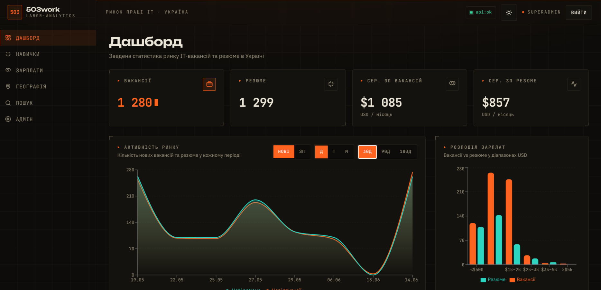
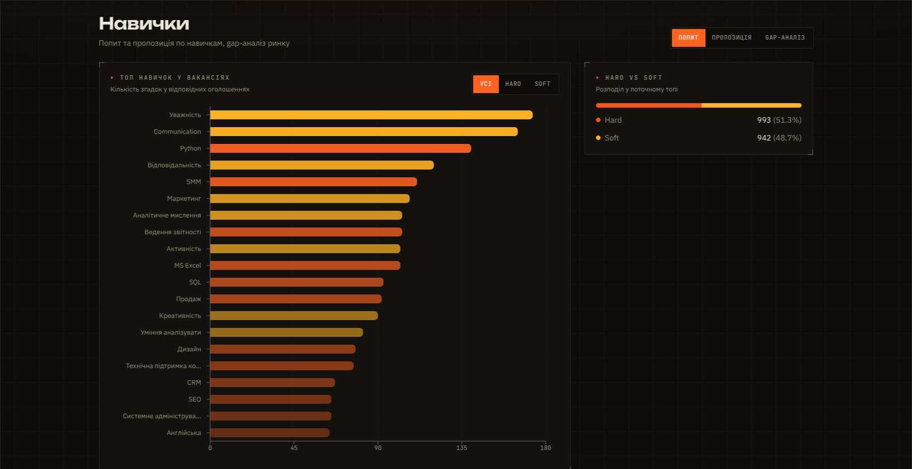
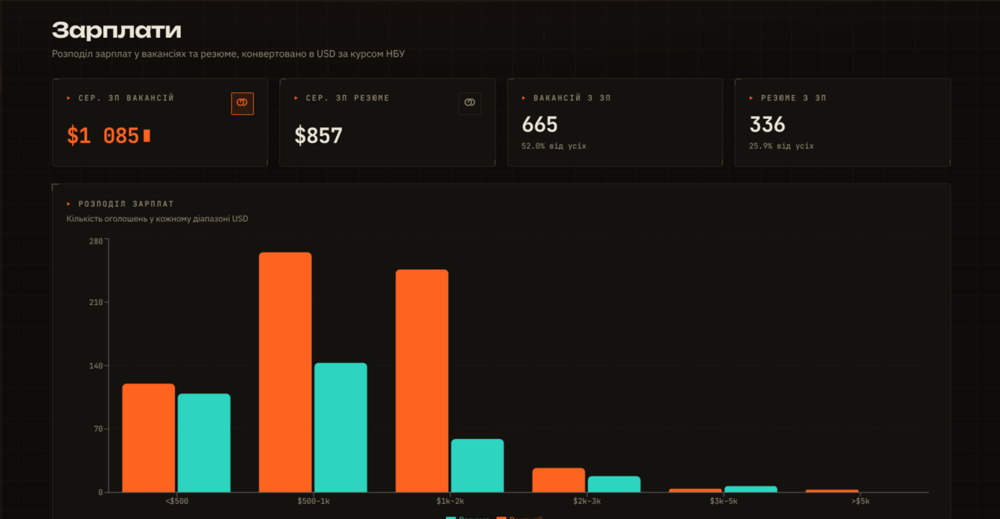
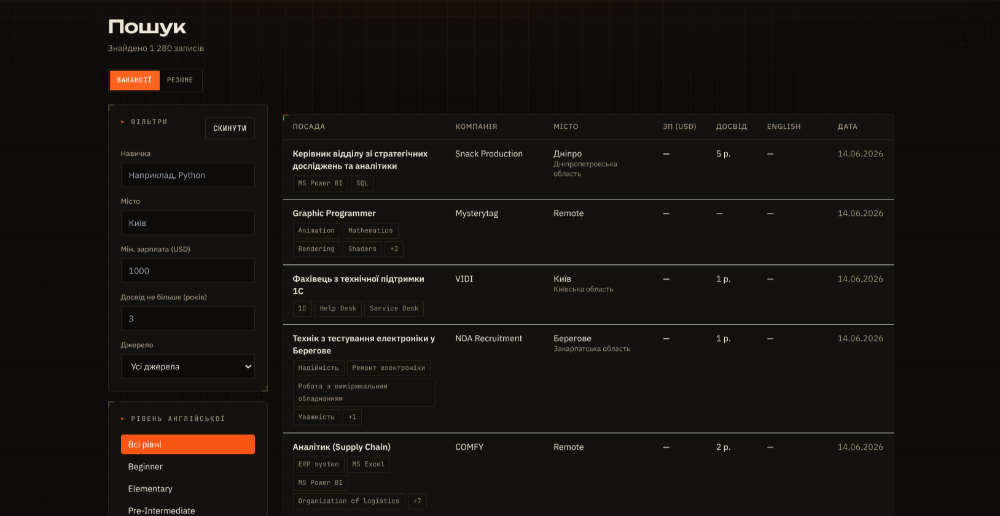

<div align="center">

# 503Work

### Аналітика українського IT-ринку праці

*ETL-пайплайн і дашборд, що перетворює сирі вакансії та резюме з work.ua, DOU і robota.ua на готову аналітику попиту, зарплат і географії.*


</div>

---

## Що це

**503Work** збирає вакансії та резюме з трьох джерел — [work.ua](https://www.work.ua), [DOU](https://dou.ua) і [robota.ua](https://robota.ua) — витягує навички/зарплати/досвід через **каскад безкоштовних LLM** (Cerebras → Groq → Gemini → Mistral), конвертує оплату в USD за курсом НБУ і подає все через REST API та React-дашборд.

> **Що нового у 2.0.0**
> - **Багатоджерельний збір:** до work.ua додано DOU (RSS) і robota.ua (GraphQL).
> - **LLM-каскад замість одного Groq:** послідовний fallback по безкоштовних OpenAI-сумісних провайдерах — добова продуктивність = сума їхніх денних квот.
> - **Drain-режим NLP:** один запуск крутить порції, поки черга не спорожніє або не вичерпаються денні бюджети провайдерів.
> - **Розбивка за джерелами** в аналітиці (`/api/analytics/sources`) та метрики сервера в адмінці.

---

## Швидкий старт

```bash
git clone <repo>
cd project
cp .env.example .env      # заповни хоча б один LLM-ключ, JWT_SECRET, DB_PASSWORD

docker compose up -d --build
```

Відкрий [http://localhost:5173](http://localhost:5173) — готово.

> Перший запуск ETL-пайплайну (збір + LLM-обробка) займає 30–90 хв:
> ```bash
> docker compose run --rm etl_worker
> ```

---

## Скріншоти

| Дашборд | Навички |
|---------|---------|
|  |  |

| Зарплати | Пошук  |
|----------|-----------|
|  |  |

---

## Архітектура

```
┌──────────┐
│ work.ua  │─┐  HTML (aiohttp + bs4)
└──────────┘ │
┌──────────┐ │   ┌───────────────┐   ┌──────────────────────┐   ┌────────────┐
│   DOU    │─┼──▶│  src/scrapers │──▶│   LLM-каскад         │──▶│ PostgreSQL │
└──────────┘ │   │  src/sources  │   │  Cerebras → Groq →   │   │  core.*    │
┌──────────┐ │   │  → staging.*  │   │  Gemini → Mistral    │   └─────┬──────┘
│ robota.ua│─┘   └───────────────┘   └──────────────────────┘         │
└──────────┘      RSS / GraphQL       fallback + drain-режим          │
                        ┌──────────────────────────────────────────────┘
                        ▼
                ┌──────────────┐         ┌──────────────────────┐
                │  FastAPI     │◀────────│  nginx               │
                │  :8000       │   JSON  │  :5173               │
                │  src/api     │         │  React + Vite        │
                │  src/admin   │         │  recharts            │
                │  src/client  │         └──────────────────────┘
                │  src/auth    │
                └──────────────┘
                       ▲
               ┌───────┴──────┐
               │   Prefect    │  collect → NLP (cascade) → currency → snapshot
               │   flow       │
               └──────────────┘
```

---

## Структура проекту

```
project/
├── docker-compose.yml          # db, pgadmin, etl_worker, api, frontend
├── Dockerfile                  # образ для api та etl_worker
├── requirements.txt            # прод
├── requirements-dev.txt        # + pytest для тестів
├── run_pipeline.py             # точка входу Prefect-пайплайну
│
├── src/
│   ├── scrapers/               # work.ua (HTML, aiohttp + bs4)
│   │   ├── workua_vacancies.py
│   │   └── workua_resumes.py
│   ├── sources/                # додаткові джерела (через LLM-обробку)
│   │   ├── dou_rss.py          # DOU — RSS-стрічки вакансій
│   │   └── robota_vacancies.py # robota.ua — GraphQL (браузерні заголовки)
│   ├── processor/              # LLM-обробка, нормалізація, валюта
│   │   ├── llm_cascade.py      # каскад провайдерів: complete() + fallback
│   │   ├── rate_limiter.py     # DailyBudget (TPD/RPD) + TokenBucketRateLimiter
│   │   ├── llm_utils.py        # парсинг retry-after тощо
│   │   ├── nlp_vacancies.py    # drain-режим, пише в core.*
│   │   ├── nlp_resumes.py
│   │   ├── schemas.py          # Pydantic-схеми виводу LLM
│   │   ├── skill_normalizer.py
│   │   ├── currency_converter.py
│   │   ├── analytics_snapshot.py
│   │   └── failure_tracker.py
│   ├── db/                     # пул asyncpg-з'єднань
│   ├── api/                    # FastAPI app + endpoints
│   │   ├── ratelimit.py        # IP-rate-limit для публічних ендпоінтів
│   │   └── routes/
│   │       ├── analytics.py    # 12 аналітичних endpoints
│   │       ├── tracking.py     # POST /api/track (анонімний beacon)
│   │       └── health.py
│   ├── admin/                  # адмін-підсистема (SOLID)
│   │   ├── interfaces.py       # Protocol-інтерфейси (ISP/DIP)
│   │   ├── services.py         # StatsService, FailureService, PipelineService, SystemService
│   │   ├── facade.py           # AdminFacade singleton
│   │   └── router.py           # /api/admin/* (захищені JWT)
│   ├── client/                 # клієнтська підсистема (GoF)
│   │   ├── filters.py          # Strategy-фільтри
│   │   ├── factory.py          # FilterStrategyFactory
│   │   ├── repository.py       # VacancyRepository, ResumeRepository
│   │   ├── facade.py           # MarketDataFacade singleton
│   │   └── router.py           # /api/client/*
│   ├── auth/                   # JWT-автентифікація (акаунти в auth.users)
│   │   ├── bootstrap.py        # засів адміна з ADMIN_USERNAME/PASSWORD
│   │   ├── repository.py
│   │   ├── security.py
│   │   └── router.py           # /api/auth/login, /api/auth/me
│   └── tracking/               # облік анонімних візитів
│       ├── bootstrap.py
│       └── repository.py
│
├── scripts/
│   └── create_user.py          # додати адмін-акаунт: python -m scripts.create_user
│
├── frontend/
│   ├── Dockerfile              # multi-stage: node build → nginx
│   ├── nginx.conf              # роздача статики + proxy /api → backend
│   ├── vite.config.ts          # proxy для локальної розробки
│   └── src/
│       ├── auth/               # AuthContext (токен у localStorage)
│       ├── api/                # client.ts, hooks.ts, types.ts
│       ├── components/         # UI-компоненти + charts/
│       └── pages/
│           ├── DashboardPage   # KPI + огляд
│           ├── SkillsPage      # топ навичок + gap-аналіз
│           ├── SalaryPage      # розподіл зарплат + досвід
│           ├── GeographyPage   # географія
│           ├── ClientSearchPage # пошук вакансій/резюме з фільтрами
│           ├── AdminPage       # адмін-панель (потребує входу)
│           └── LoginPage       # форма входу
│
├── tests/                      # pytest (каскад, бюджети, rate-limiter)
└── init_db/                    # SQL-міграції (00–09)
```

---

## REST API

```
GET  /health                              # стан API + БД

# Аналітика
GET  /api/analytics/overview              # KPI ринку
GET  /api/analytics/snapshots             # денні зрізи ринку
GET  /api/analytics/activity              # нові оголошення по бакетах
GET  /api/analytics/experience-timeline   # junior/middle/senior у часі
GET  /api/analytics/skills                # топ навичок
GET  /api/analytics/skills/gap            # gap-аналіз
GET  /api/analytics/salary-distribution   # гістограма ЗП
GET  /api/analytics/experience-levels     # ЗП по рівнях досвіду
GET  /api/analytics/english-levels        # рівні англійської
GET  /api/analytics/locations             # географія
GET  /api/analytics/companies             # топ роботодавців
GET  /api/analytics/sources               # розбивка за джерелами (work.ua/DOU/robota.ua)

# Облік відвідувань
POST /api/track                           # анонімний beacon (204, rate-limited)

# Клієнтська підсистема — пошук з фільтрами
GET  /api/client/vacancies/search         # skill, location, salary, english_level
GET  /api/client/resumes/search           # skill, location, salary, experience_min

# Адмін-підсистема — потребує Bearer-токена
POST  /api/auth/login                     # → { access_token }
GET   /api/auth/me
GET   /api/admin/stats                    # статистика БД
GET   /api/admin/system                   # метрики сервера + користувачі
GET   /api/admin/pipeline/status          # черга + помилки
GET   /api/admin/failures                 # список нерозв'язаних помилок
PATCH /api/admin/failures/{id}/resolve    # позначити як вирішену
```

Swagger UI: [http://localhost:8000/docs](http://localhost:8000/docs)

---

## LLM-каскад

NLP-обробка йде через **послідовний fallback** по безкоштовних OpenAI-сумісних провайдерах. На кожен запис береться перший провайдер, чий **денний бюджет** ще не вичерпано; при `429`/помилці його «остуджують» (cooldown) і падають на наступного. Сумарна добова продуктивність = сума денних квот усіх увімкнених провайдерів.

| Провайдер | Модель (default) | Безкоштовна стеля | Реєстрація |
|-----------|------------------|-------------------|------------|
| Cerebras  | `gpt-oss-120b` (`reasoning_effort=low`) | ~1 млн токенів/добу, 5 RPM | [cloud.cerebras.ai](https://cloud.cerebras.ai) — без картки |
| Groq      | `meta-llama/llama-4-scout-17b-16e-instruct` | 500K токенів/добу | [console.groq.com](https://console.groq.com) |
| Gemini    | `gemini-3.1-flash-lite` | 500 запитів/добу | [aistudio.google.com](https://aistudio.google.com/apikey) |
| Mistral   | `mistral-small-latest` | ~1 млрд токенів/міс (free «Experiment») | [console.mistral.ai](https://console.mistral.ai) |

Активуються лише провайдери, для яких заданий API-ключ. Достатньо **одного**; рекомендований мінімум — Cerebras + Groq. Порядок і моделі перевизначаються через env (`LLM_PROVIDER_ORDER`, `*_MODEL`).

---

## Змінні середовища

Скопіюй `.env.example` → `.env` і заповни (повний список — у [docs/DOCS.md](docs/DOCS.md)):

| Змінна | Опис |
|--------|------|
| `DB_USER` / `DB_PASSWORD` / `DB_NAME` | PostgreSQL |
| `CEREBRAS_API_KEY` / `GROQ_API_KEY` / `GEMINI_API_KEY` / `MISTRAL_API_KEY` | LLM-каскад — достатньо хоча б одного |
| `LLM_PROVIDER_ORDER` | Порядок/склад каскаду через кому (необов'язково) |
| `NLP_BATCH_LIMIT` | Розмір порції в drain-режимі (default 200) |
| `ROBOTA_MAX_PAGES` | Скільки сторінок robota.ua за прогін (default 25) |
| `JWT_SECRET` | **Обов'язково** — застосунок не стартує з порожнім (`openssl rand -hex 32`) |
| `ADMIN_USERNAME` / `ADMIN_PASSWORD` | Засів першого адмін-акаунта в `auth.users` |
| `CORS_ORIGINS` | Дозволені origins для браузера |

---

## Docker-сервіси

| Сервіс | Образ | Порт |
|--------|-------|------|
| `db` | postgres:16-alpine | 5432 |
| `pgadmin` | dpage/pgadmin4 | 5050 |
| `api` | ./Dockerfile | 8000 |
| `etl_worker` | ./Dockerfile | — |
| `frontend` | ./frontend/Dockerfile | 5173 |

---

## Локальна розробка (без Docker)

```bash
# Backend
conda activate labor_market   # або будь-який venv з requirements.txt
uvicorn src.api.main:app --reload --port 8000

# Frontend (Vite проксує /api → localhost:8000 автоматично)
cd frontend && npm install && npm run dev

# Тести
pip install -r requirements-dev.txt && pytest
```

---

## Документація

| Файл | Зміст |
|------|-------|
| [docs/DOCS.md](docs/DOCS.md) | Технічний довідник: каскад, схема БД, env, troubleshooting |
| [docs/DEPLOY.md](docs/DEPLOY.md) | Production-деплой: nginx, Let's Encrypt, systemd |

---

<div align="center">

Дані: [work.ua](https://www.work.ua) · [DOU](https://dou.ua) · [robota.ua](https://robota.ua)  
LLM: [Cerebras](https://cloud.cerebras.ai) · [Groq](https://groq.com) · [Gemini](https://ai.google.dev) · [Mistral](https://mistral.ai)

</div>
