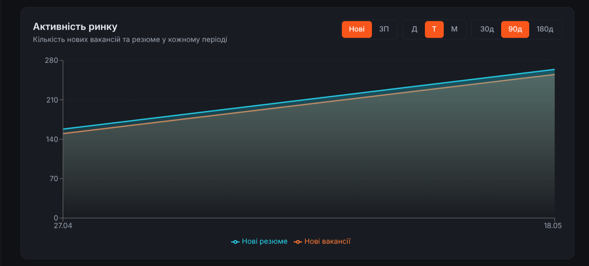

<div align="center">

# 503Work

### Аналітика українського IT-ринку праці у реальному часі

*Open-source ETL-пайплайн і дашборд, який перетворює сирі дані з work.ua на готову до прийняття рішень аналітику попиту, пропозиції, зарплат і географії.*


</div>

---

## Що це

**503Work** — система, яка щодня збирає вакансії та резюме з [work.ua](https://www.work.ua), пропускає текст через LLM (Groq `llama-4-scout-17b`) для витягання навичок/зарплат/досвіду, конвертує оплату у USD за курсом НБУ і подає це через REST API та інтерактивний React-дашборд.

Це не ще один job board. Це **аналітичний інструмент** для:

- Дослідників ринку праці та економістів
- HR-команд, які хочуть бачити реальний попит на навички
- Кандидатів, які шукають дані для розмови про зарплату
- Студентів, які пишуть курсову з аналізу даних
- Всіх, кому набридло вгадувати "скільки зараз платять Python-розробникам"

---

## Що вміє

### Збір та обробка
- **Асинхронний скрейпінг** work.ua — до 50 сторінок вакансій + 50 сторінок резюме за прогін
- **LLM-екстракція** із підтримкою retry, rate-limit та budget guard (Groq має 20 RPM)
- **Нормалізація навичок** — `Python 3`, `python`, `Пайтон` → одна сутність
- **Конвертація зарплат** у USD за щоденним курсом НБУ
- **Failure tracking** — кожне падіння логується для повторної обробки

### Аналітика
- **Активність ринку** — нові оголошення по day/week/month бакетах
- **Структура досвіду у часі** — як зсувається попит між junior/middle/senior
- **Gap-аналіз навичок** — де є дефіцит, де перенасичення
- **Розподіл зарплат** — гістограма USD-діапазонів, зарплата vs досвід
- **Географія** — топ міст за вакансіями і резюме окремо
- **Англійська** — рівень вимог у вакансіях
- **Топ роботодавців** — хто наймає найбільше

### Інтерфейс
- 6 сторінок дашборда з фільтрацією та пагінацією
- Світла/темна тема з персистенцією
- Адаптивність mobile → desktop
- Health-індикатор API у топбарі

---

## Скріншоти

> _Покладіть PNG'и у `docs/screenshots/` і замініть посилання нижче — README автоматично їх покаже._

| Дашборд | Активність ринку |
|---------|------------------|
|  |  |

| Навички та Gap | Зарплати vs досвід |
|----------------|---------------------|
|  |  |

---

## Архітектура

```
┌──────────┐    ┌────────────┐    ┌──────────┐    ┌────────────┐
│ work.ua  │───▶│  Scraper   │───▶│  Groq    │───▶│ PostgreSQL │
│  (HTML)  │    │  aiohttp   │    │ llama-4  │    │  core.*    │
└──────────┘    │  + bs4     │    │ scout    │    └─────┬──────┘
                └────────────┘    └──────────┘          │
                                                        │
                  ┌─────────────────────────────────────┘
                  ▼
          ┌──────────────┐         ┌─────────────────┐
          │  FastAPI     │◀────────│  503Work UI     │
          │  :8000       │   JSON  │  React + Vite   │
          │              │         │  recharts       │
          └──────────────┘         └─────────────────┘
                ▲
                │
          ┌──────┴───────┐
          │   Prefect    │  Оркестрація 4 стадій пайплайну:
          │   flow       │  scrape → NLP → currency → snapshot
          └──────────────┘
```

---

## Швидкий старт

```bash
git clone https://github.com/<your-org>/503work.git
cd 503work
cp .env.example .env                  # додай GROQ_API_KEY

docker compose up db api -d           # БД + API → :8000
docker compose run --rm etl_worker    # 30-90 хв збору + LLM-обробки

cd frontend && npm install && npm run dev    # UI → :5173
```

Готово — відкривай [http://localhost:5173](http://localhost:5173).

Більше деталей: **[DOCS.md](DOCS.md)** (технічна довідка) і **[DEPLOY.md](DEPLOY.md)** (production-деплой).

---

## Стек технологій

**Backend** — Python 3.11, asyncio, aiohttp, BeautifulSoup, asyncpg, Pydantic v2, FastAPI, Prefect, Groq SDK
**Database** — PostgreSQL 16 (4 схеми: `staging`, `dictionaries`, `core`, `analytics`)
**Frontend** — React 19, TypeScript 5, Vite, Tailwind CSS 3, React Router v6, TanStack Query, recharts
**Infra** — Docker Compose, nginx (production), Let's Encrypt

---

## REST API

13 endpoints для будь-якого зрізу даних:

```
GET /api/analytics/overview                # KPI ринку
GET /api/analytics/activity                # Нові оголошення по бакетах
GET /api/analytics/experience-timeline     # Junior/Middle/Senior у часі
GET /api/analytics/skills                  # Топ навичок
GET /api/analytics/skills/gap              # Gap-аналіз
GET /api/analytics/salary-distribution     # Гістограма ЗП
GET /api/analytics/experience-levels       # ЗП по рівнях досвіду
GET /api/analytics/english-levels          # Рівні англійської
GET /api/analytics/locations               # Географія
GET /api/analytics/companies               # Топ роботодавців
GET /api/vacancies/                        # Пошук вакансій
GET /api/resumes/                          # Пошук резюме
GET /health                                # Стан API + БД
```

Інтерактивна Swagger-документація: `http://localhost:8000/docs`.

---

## Документація

| Файл | Що всередині |
|------|--------------|
| **[DOCS.md](DOCS.md)** | Технічний довідник: структура проекту, всі endpoints, env-змінні, схема БД, команди, troubleshooting |
| **[DEPLOY.md](DEPLOY.md)** | Production-деплой на VPS: nginx, Let's Encrypt, systemd, бекапи, security checklist, альтернативи (Railway/Vercel/Neon) |
| **[frontend/README.md](frontend/README.md)** | README фронтенду: структура, скрипти, тема, env |
---

## Чому "503"

`HTTP 503 Service Unavailable` — стан українського ринку праці після початку повномасштабної війни: тисячі айтівців виїхали або змінили рід діяльності, компанії заморожують найм, а ті що працюють — конкурують за вузьке коло сеньйорів. Цей проект намагається показати картину **числами замість здогадок**.

---

## Roadmap

- [x] Скрейпер work.ua (вакансії + резюме)
- [x] LLM-нормалізація через Groq
- [x] REST API з 13 endpoints
- [x] React-дашборд з 6 сторінками
- [x] Production deploy guide
- [ ] Підтримка інших джерел: djinni.co, dou.ua
- [ ] Email-алерти по нових вакансіях за фільтром
- [ ] CSV/Parquet експорт для дослідників
- [ ] Публічне дзеркало `503work.example` з read-only доступом
- [ ] Telegram-бот з щоденним звітом

---

## Внесок у проект

Будь-який PR вітається — від виправлення опечатки в README до нового аналітичного endpoint.

1. Fork → нова гілка від `master` (`feature/...` або `fix/...`)
2. Коміт у форматі з [.gitmessage](.gitmessage): `тип(scope): опис`
3. PR з описом ЩО і ЧОМУ

Для розробки — див. **[DOCS.md](DOCS.md#локальний-запуск-без-docker)**.

---

## Ліцензія

[MIT](LICENSE) — використовуйте, форкайте, продавайте свої аналітичні звіти. Згадка авторства буде приємною, але не обов'язковою.

---

<div align="center">

**[Документація](DOCS.md)** · **[Деплой](DEPLOY.md)** · **[API](http://localhost:8000/docs)**

Зроблено для TRPZ. Дані: [work.ua](https://www.work.ua). LLM: [Groq](https://groq.com).

</div>
